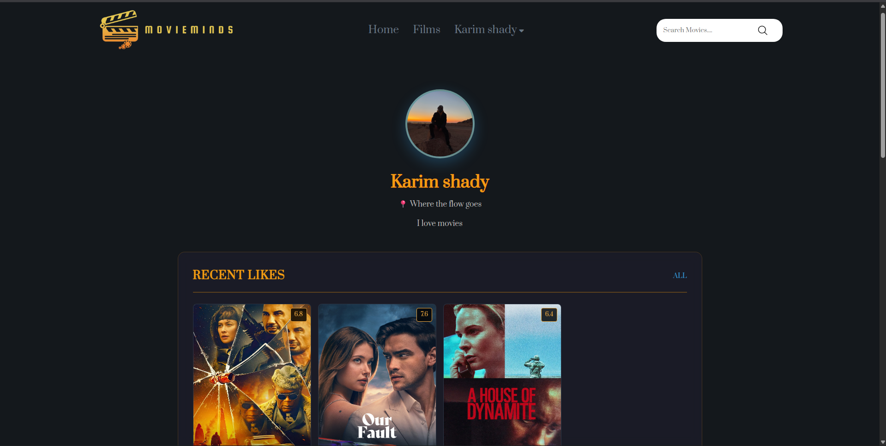
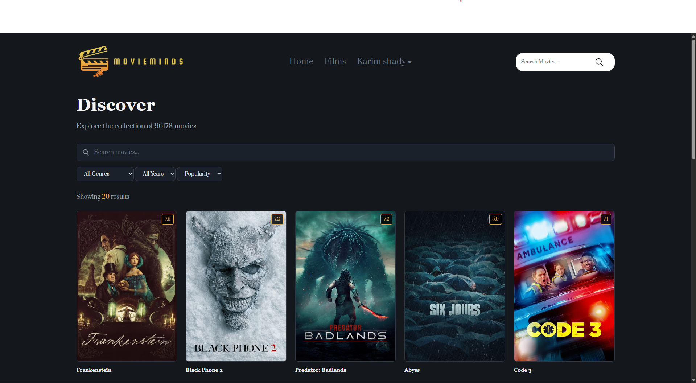
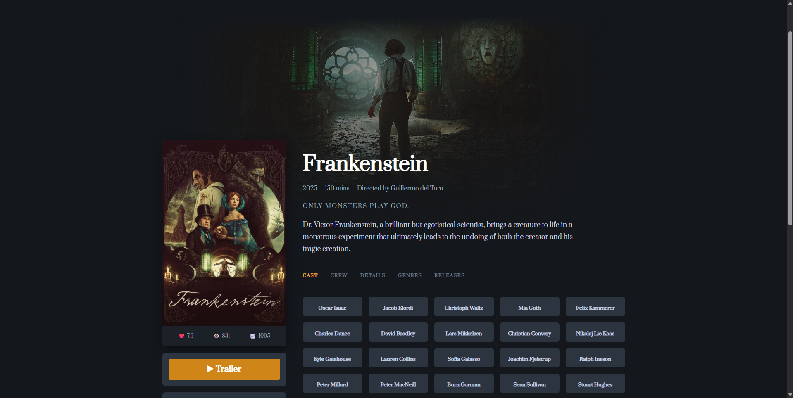
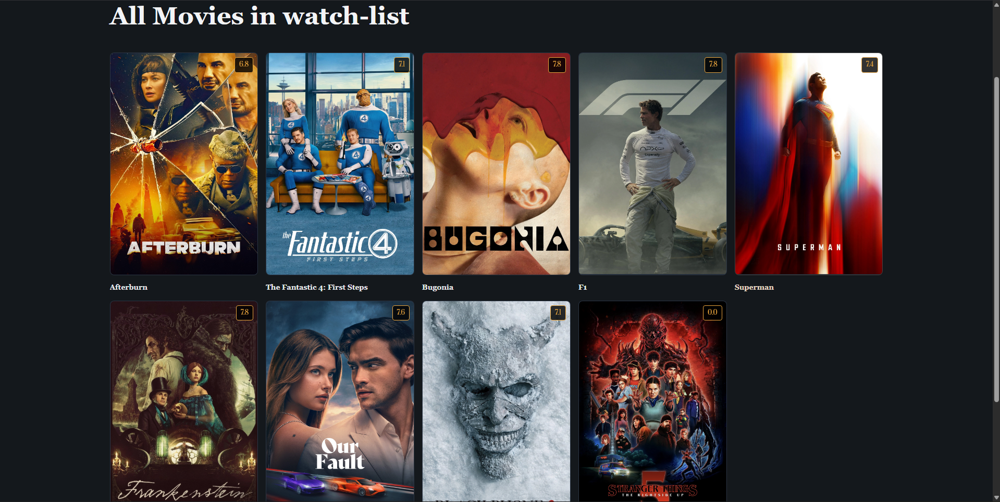
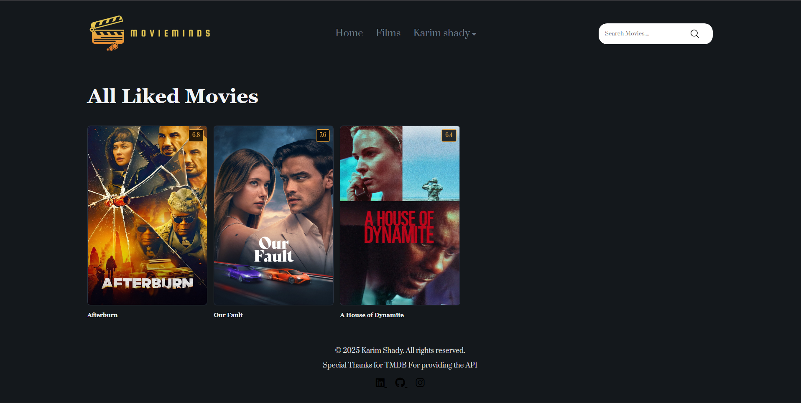

# 🎬 MovieMinds  

> A personal movie library web application built with **ASP.NET Core MVC**, **SQL Server**, and **TMDB API** integration.  
> Users can explore, search, and manage their favorite movies in an intuitive, responsive interface.

---

## 🧠 Overview  

**MovieMinds** allows users to discover movies, view detailed information, and manage personal watchlists.  
It integrates with **The Movie Database (TMDB)** API to fetch live movie data such as title, poster, release date, genres, and watch provider availability.  

Users can:
- Register and log in using **cookie-based authentication**
- Search for movies
- Add movies to watchlists, liked, or watched lists
- Edit their profile
- View personalized movie collections (Liked, Watched, Watchlist)
- Enjoy a responsive and clean UI

---

## 📸 Screenshots  

### 🔐 Authentication & Profile  
  


### 🎥 Discover & Movie Details  
  


### 🎬 Watchlist & Liked Movies  
  


---

## ⚙️ Tech Stack  

| Layer               | Technology                                |
| ------------------- | ----------------------------------------- |
| **Frontend**        | HTML5, CSS3                               |
| **Backend**         | ASP.NET Core MVC (C#)                     |
| **Database**        | SQL Server                                |
| **API**             | The Movie Database (TMDB)                 |
| **Auth**            | Cookie-based authentication with sessions |
| **IDE**             | Visual Studio 2022                        |
| **Version Control** | Git & GitHub                              |

---

## 🚀 Features  

- 🔑 **User Authentication** — Register, login, and manage sessions securely  
- 🔍 **Movie Discovery** — Browse trending movies from TMDB  
- 🎞️ **Detailed Movie View** — View cast, release info, and providers  
- ❤️ **Watchlist & Favorites** — Add/remove movies easily  
- 👤 **Profile Management** — See your liked, watched, and watchlisted movies  
- 🌐 **External API Integration** — Fetches real-time data from TMDB  
- 💻 **Responsive Design** — Built with a clean, modern layout  

---

## 🏗️ Project Structure  

```plaintext
MovieMinds/
│
├── Controllers/              # Handles HTTP requests and routing
│   ├── AccountController.cs
│   ├── AuthController.cs
│   ├── DiscoverController.cs
│   ├── HomeController.cs
│   └── MovieDetailsController.cs
│
├── Models/                   # Data models (Entities + DTOs)
│   ├── Entities/             # Movie, User, UserMovie
│   └── DTO/                  # TMDB API response DTOs
│
├── Repositories/             # Data access layer
│   ├── Interfaces/
│   └── Implementations/
│
├── Services/                 # Business logic & API calls
│   ├── Interfaces/
│   └── Implementations/
│
├── ViewModels/               # Data passed between controllers and views
│
├── Views/                    # Razor views (UI)
│   ├── Account/
│   ├── Discover/
│   ├── Home/
│   ├── MovieDetails/
│   └── Shared/
│
├── Data/
│   ├── MovieMindsDbContext.cs
│   └── Migrations/
│
├── wwwroot/                  # Static assets (CSS, JS, Images)
│
├── appsettings.json          # Configuration file (DB connection, API key)
├── Program.cs                # App entry point
└── README.md                 # Project documentation
```

---

## 🧰 Setup & Installation  

Follow these steps to run the project locally:

### 1️⃣ Clone the repository  
```bash
git clone https://github.com/Karimshady81/Movie-Minds.git
cd MovieMinds
```

### 2️⃣ Open in Visual Studio  
- Open `MovieMinds.sln` in **Visual Studio 2022**

### 3️⃣ Configure Database  
- Update your **SQL Server connection string** in `appsettings.json`:
```json
"ConnectionStrings": {
  "DefaultConnection": "Server=.;Database=MovieMindsDb;Trusted_Connection=True;TrustServerCertificate=True;"
}
```

### 4️⃣ Add your TMDB API key  
In `appsettings.json`, add:
```json
"TMDB": {
  "ApiKey": "YOUR_TMDB_API_KEY"
}
```
Get your API key from [https://www.themoviedb.org](https://www.themoviedb.org).

### 5️⃣ Apply migrations  
```bash
Update-Database
```

### 6️⃣ Run the project  
- Press **F5** or use:
```bash
dotnet run
```
- Visit: [http://localhost:5000](http://localhost:5000)

---

## 🧠 Example Usage  

Once running locally:
1. Register or log in  
2. Browse movies from TMDB’s Discover endpoint  
3. View movie details and providers  
4. Add to watchlist or liked movies  
5. Manage your profile and lists  

---

## 🧩 Architecture  

The project follows a **Layered Architecture (MVC)** pattern:

- **Controllers:** Handle user requests and route data between UI and services  
- **Models:** Contain entities and DTOs representing movies, users, and API data  
- **Repositories:** Manage data access and database interactions  
- **Services:** Handle business logic and API communication (TMDB)  
- **Views:** Razor Pages for rendering HTML and UI components  

---

## 🧱 Database Schema (Simplified)

| Table | Description |
|-------|-------------|
| **Users** | Stores user info (ID, username, password, profile) |
| **Movies** | Contains movie details fetched from TMDB |
| **UserMovies** | Tracks user’s watchlist, liked, and watched movies |

---

## 🌟 Future Improvements  

- Add rating and review system  
- Allow custom movie collections  
- Enable dark mode theme  

---

## 👨‍💻 Author  

**Karim Shady**  
📧 [kshady960@gmail.com]  
💼 [GitHub Profile](https://github.com/Karimshady81)

---

> 💡 *MovieMinds is a personal learning project built to practice ASP.NET MVC architecture, external API integration, and database design using SQL Server.*

---
